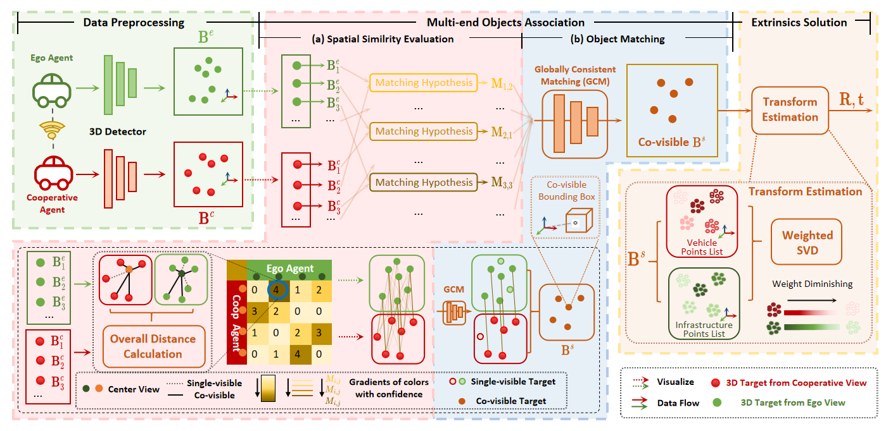

# V2I-Calib / V2X-Reg++: Object-Level Online Registration for V2I/V2X

<h3 align="center">
  <a href="https://ieeexplore.ieee.org/abstract/document/10802098"> </a>
  <a href="https://arxiv.org/abs/2410.11008"></a>
</h3>

<div align="center">
  
</div>

## Overview

This repository contains an **object-level, online registration / calibration solver** for vehicle–infrastructure and multi-terminal sensing, using **3D detection boxes** as the geometric primitives.

Two variants are supported:
- **V2I-Calib**: oIoU-based association (IROS 2024).
- **V2X-Reg++**: distance-based association (IEEE T-ITS).

## Getting Started

### Installation

```bash
conda create -n v2xreg python=3.10 -y
conda activate v2xreg
pip install -r requirements.txt
```

Optional (only for baseline scripts under `benchmarks/`):
```bash
git submodule update --init --recursive
pip install open3d==0.17.* torch==2.3.*
```

### Dataset: DAIR-V2X

Download the official cooperative split and place it under:
- `data/DAIR-V2X/cooperative-vehicle-infrastructure/`

If you keep the dataset elsewhere, create a symlink:
```bash
ln -s /path/to/cooperative-vehicle-infrastructure data/DAIR-V2X/cooperative-vehicle-infrastructure
```

Minimal files used by the **object-level pipeline**:
```text
cooperative-vehicle-infrastructure/
  cooperative/
    data_info.json
    calib/lidar_i2v/{vehicle_frame_id}.json
  infrastructure-side/label/virtuallidar/{infrastructure_frame_id}.json
  vehicle-side/label/lidar/{vehicle_frame_id}.json
```

Notes:
- The ground-truth transform is loaded from `cooperative/calib/lidar_i2v/*.json` (no extra post-processing in the public pipeline).
- Images/point clouds are not required for the default object-level evaluation, but are needed by some baselines in `benchmarks/`.

## Run (DAIR-V2X)

- Single run on the official test split (GT boxes):
  ```bash
  python tools/run_calibration.py --config configs/pipeline.yaml --print
  ```

- Table III GT sweeps (Top-3000 subset):
  ```bash
  python tools/run_dair_pipeline_experiments.py --config configs/pipeline_top3000.yaml
  ```

Outputs are written to `outputs/<tag>/`:
- `metrics.json`: aggregated metrics + avg runtime
- `matches.jsonl`: per-pair RE/TE, timing and match details

## Reproducibility

- 本仓库提供复现实验脚本；补充实验数据/日志仍在整理（“实验数据待整理”），论文中的表格/数字以论文为准。

## Docs

- Minimal entrypoint: `docs/operations/experiment_progress_public.md`
- Reproduction guide: `docs/operations/experiment_reproduction.md`

## Acknowledgment

This project is not possible without the following codebases:
- [DAIR-V2X](https://github.com/AIR-THU/DAIR-V2X)
- [LiDAR-Registration-Benchmark](https://github.com/HKUST-Aerial-Robotics/LiDAR-Registration-Benchmark)

## Citation

If you find our work or this repo useful, please cite:
```bibtex
@inproceedings{qu2024v2i,
  title={V2I-Calib: A novel calibration approach for collaborative vehicle and infrastructure lidar systems},
  author={Qu, Qianxin and Xiong, Yijin and Zhang, Guipeng and Wu, Xin and Gao, Xiaohan and Gao, Xin and Li, Hanyu and Guo, Shichun and Zhang, Guoying},
  booktitle={2024 IEEE/RSJ International Conference on Intelligent Robots and Systems (IROS)},
  pages={892--897},
  year={2024},
  organization={IEEE}
}

@article{zhang2025v2x,
  title={V2X-Reg++: A Real-Time Global Registration Method for Multi-End Sensing System in Urban Intersections},
  author={Zhang, Xinyu and Qu, Qianxin and Xiong, Yijin and Xia, Chen and Song, Ziqiang and Peng, Qian and Liu, Kang and Li, Jun and Li, Keqiang},
  journal={IEEE Transactions on Intelligent Transportation Systems},
  year={2025},
  publisher={IEEE}
}
```
